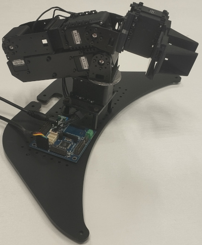

TL;DR -- The impatients can skip directly to the last section of this page.


# Preamble

I had the opportunity to play with a Pincher MK3 robotic arm. This page tells the story of my adventures with some low-level considerations...

The Pincher MK3 5-DOF Robotic Arm was offered as a standard option on the [TurtleBot 2i](https://www.therobotreport.com/turtlebot-2i-new-chassis-robot-arm-support-intel-joule/)
when it was released in 2017.

It consists of 5 [Dynamixel AX12-A](https://emanual.robotis.com/docs/en/dxl/ax/ax-12a/) servomotors (waist shoulder elbow wrist gripper), 
controlled by an [ArbotiX-M](https://vanadiumlabs.github.io/arbotix/).

Note that it is quite similar to the [PhantomX](https://www.generationrobots.com/media/PhantomX_Pincher/PhantomX_Pincher_Arm_Quickstart.pdf), 
except for the elbow geometry which is rotated 90°.

 


## The Dynamixel Communication Bus

Dynamixel servomotors use digital communications carried by an [RS232](https://en.wikipedia.org/wiki/RS-232) link (3-wire connectors)
or an [RS485](https://en.wikipedia.org/wiki/RS-485) (4-wire connectors).
(RS485 links are more robust to electrical interference, and are often preferred in industrial settings.)

These are serial links, in the sense that bits are transmitted one after the other to form bytes, and bytes one after the other to form messages.
(Actually, that's the role of the [UART](https://en.wikipedia.org/wiki/Universal_asynchronous_receiver-transmitter) over RS232/RS485, but we can disregard it here.
Also note that [TTL](https://en.wikipedia.org/wiki/Transistor%E2%80%93transistor_logic#Serial_signaling) is sometimes used as a synonym for RS232, 
although in fact this acronym would be just as valid in an RS485 context; this is simply to indicate that the voltage here is 3.3V or 5V, not 12V.)

RS232 and RS485 are designed primarily to be point-to-point connections: only two participants.
And, to be effective, RS232 and RS485 offer bidirectional communication (*full duplex*), with each participant having a *transmit* line and a *receive* line.
(The transmit line of one is connected to the receive line of the other, and vice versa.)

Two classic techniques can be cited to transform such point-to-point communications into bus-mode communication: *daisy chain* and *half duplex*.

- With the *Dasy Chain strategy*, each participant has two full duplex communication ports. (A rich person's solution.)
  All participants are connected one after the other.
  When a participant receives data on one port, it retransmits it on the other port for the next participant, and so on.
  (Some examples: [AppleTalk](https://en.wikipedia.org/wiki/AppleTalk#Physical_implementation) [MIDI](https://en.wikipedia.org/wiki/MIDI#Devices)
  [DMX](https://en.wikipedia.org/wiki/DMX512) ...)

- With the *Half Duplex strategy*, there is only one link which serves both for transmission and reception, but at different times.
  There is only one communication port. All participants are electrically connected in parallel on it (in a chain, in a star, it doesn't matter).
  (This strategy is much less expensive in terms of electronics.)
  One just need to make sure that there is only one participant speaking at a time; 
  when one has the right to be in transmit mode, all the others must be in receive mode.

  To do this, one need to define a *communication protocol*:
  Typically, one of the participants is designated as the *master*, and the others as *slaves*.
  The master transmit orders, the slaves receive them.
  Sometimes, the master transmit a question. 
  Immediately after transmitting his question, it switches to receive mode.
  The slave concerned by the question switches to transmission mode, transmit its response, and switches back to receive mode.
  To avoid collisions, the protocol imposes silences between messages.

  The Dynamixel bus uses this strategy: an half duplex serial line.


Regarding the design of its [message format](https://emanual.robotis.com/docs/en/dxl/protocol1/), Dynamixel follows rather typical strategies 
(compare to [Modbus](https://en.wikipedia.org/wiki/Modbus) [HDLC](https://en.wikipedia.org/wiki/High-Level_Data_Link_Control) ...):
[ static starting flags, node id, length, instruction code, instruction datas, checksum ]

Note that Dynamixel has introduced a [version 2](https://emanual.robotis.com/docs/en/dxl/protocol2/) for its protocol, which is not used in our configuration.
It might be a very bad idea to try to update our servomotors...
unless you plan to re-develop the firmware for the ArbotiX board...


## The Arbotix-M Controller

The [Arbotix-M](https://vanadiumlabs.github.io/arbotix/) controller is an Arduino-type board designed for open-source robotics projects
(e.g. [Interbotix](https://www.interbotix.com/arbotix-robocontroller) [Redohm](https://www.redohm.fr/2020/06/presentation-et-utilisation-de-la-carte-arbotix-m/)
[Nootrix](https://nootrix.com/tutorials/arbotix-arduino-dynamixel-servos/) ...)

The microcontroller has two serial line ports and several general-purpose I/Os.
One of the serial lines is used to implement a Dynamixel bus for so-called *digital* servomotors.
The other serial line can be used to communicate with the outside world, either directly with a PC or via an XBee radio card
(for example with a remote control or a joystick).
Some GPIO pins can be used to implement [PWM](https://en.wikipedia.org/wiki/Pulse-width_modulation#Servo_and_motors) ports for so-called *analog* servomotors.
Other GPIO pins can be used for various sensors, actuators, LEDs, etc.
The board also allows the servomotors to be powered (for example, our AX12-A require an external 12V power supply).

It is up to the user to use their imagination to program their own firmware for this card. (Sometime called a sketch.)
Open source projects are welcome here (e.g. [Vanadiumlabs](https://github.com/vanadiumlabs/arbotix)
[Fictionlab](https://docs.fictionlab.pl/integrations/noetic/legacy/arbotix) [JohnJsb](https://github.com/johnjsb/ArbotiX-M) ...)

When used with ROS projects (such as for a robotic arm on a TurtuleBot), the installed firmware implements a *bypass* behavior: 
the bytes from the PC are transmitted to the Dynamixel servomotors, and vice versa.
In fact, the Arbotix-M implements the specificities of the Dynamixel bus (half duplex & co.), and acts as a master node regarding the Dynamixel bus.
In addition, it provides some extra commands (besides the classic Dynamixel commands) to offer the control on its other ports and GPIO.
The communication protocol between a PC and the ArbotiX-M board is similar to the Dynamixel protocol.

On our Pincher MK3 robotic arm, the ArbotiX-M bord is in this bypass mode.
Moreover, it comes with an USB-FTDI cable to plug it on a PC.
([FDTI](https://en.wikipedia.org/wiki/FTDI) proposes a full-feature RS232 line with the optional control lines.)
We'll keep it all as it is, it's perfect.


# Control via ROS1

At the time of writing (June 2026), ROS1 is considered depreciated in favor of ROS2.
However, it is still possible to make many things work, such as the Arbotix ROS node.
But this may require some effort. Here is my recipe on Debian Forky.

```bash
apt-get install python3-roslaunch catkin rosbash python3-serial \
 ros-std-msgs libstd-msgs-dev python3-std-msgs \
 ros-geometry-msgs libgeometry-msgs-dev python3-geometry-msgs \
 ros-nav-msgs libnav-msgs-dev python3-nav-msgs \
 ros-diagnostic-msgs libdiagnostic-msgs-dev python3-diagnostic-msgs \
 ros-trajectory-msgs libtrajectory-msgs-dev python3-trajectory-msgs \
 ros-actionlib-msgs libactionlib-msgs-dev python3-actionlib-msgs \
 ros-std-srvs libstd-srvs-dev python3-std-srvs \
 python3-tf

git clone https://github.com/vanadiumlabs/arbotix_ros.git
git clone https://github.com/ros-controls/control_msgs.git
cd control_msgs ; git switch kinetic-devel ; cd ..

mkdir -p ./catkin_ws/src  
cd ./catkin_ws  
catkin_make -DCMAKE_POLICY_VERSION_MINIMUM=3.5
cp -av ../arbotix_ros/arbotix_python ../arbotix_ros/arbotix_msgs ../control_msgs/control_msgs ./src/
. devel/setup.bash  
catkin_make  
. devel/setup.bash
killall roscore ; roscore &
rosrun arbotix_python  arbotix_driver
```
Then, have fun with your favorite ROS nodes.

Unfortunately, 'arbotix_gui' does not work because it depends on wxPython gtk2.8 which is no longer supported and python3-wxgtk4.0 is not suitable.


# Control via ROS2

Nothing at the moment. But if anyone wants to embark on this adventure, don't hesitate!

A good starting point is certainly the [arbotix_ros](https://github.com/vanadiumlabs/arbotix_ros) repository,
and more specifically the file 'arbotix_ros/arbotix_python/bin/arbotix_driver',
which needs to be adapted to communicate on ROS2 topics.
Then, the entire ROS2 ecosystem can be used.


# Minimalist Control via the Serial Line

Well, the Dynamixel servomotors of the robotic arm are connected to the ArbotiX-M board, which is connected to the PC via the USB-FTDI adapter,
which is supported by the PC's standard driver,
and which appears on Linux via the special file '/dev/ttyUSB0' or '/dev/ttyUSB1' (or 'COM1' 'COM2' on Windows).

So, to summarize, we just need to write the correct bytes to /dev/ttyUSB0 (according to the Dynamixel message format & protocol).
If we simply want to make our robot move, we don't need any middleware (ROS or similar).

The few Python files offered in this repository do precisely that.
The only dependency is the standard PySerial library, which is most likely already installed on your computer.
There is no catkin/venv/pip/whatever of any kind.

Note that 'arbotix.py' 'ax12.py' 'arbotix_terminal' come from the [Vanadiumlabs](https://github.com/vanadiumlabs/arbotix_ros) repository.
(These files are subject to their own licence; the other files included here are licensed under the GPL.)
Actually, there's nothing really new here. Just explanations.

```shell
$ git clone https://github.com/chlohr/arbotix_arm.git
$ cd ./arbotix_arm
$ python3 ./arbotix_terminal
^C
$ python3 ./arbotix_watch
^C
$ python3 ./pincher
```

I noticed that I had to run 'ls' once or twice in 'arbotix_terminal' to wake up the servomotors before everthing else.
(Or, more likely, to ensure the pyserial library correctly configures the serial port.)

I also noticed that the servomotor on my gripper was incorrectly mounted, and that its disc was rotated a quarter turn.
The 'arbotix_terminal' tool is very useful for checking servomotors one after the other; check the interval of the positions, etc.

The `arbotix_watch` code first disengages the servomotors (you can then move them manually) and then queries them in a loop to get their position while you move them.

The `pincher` code is just a demonstration with random moves, nothing sophisticated. Feel free to adapt it to your needs.
